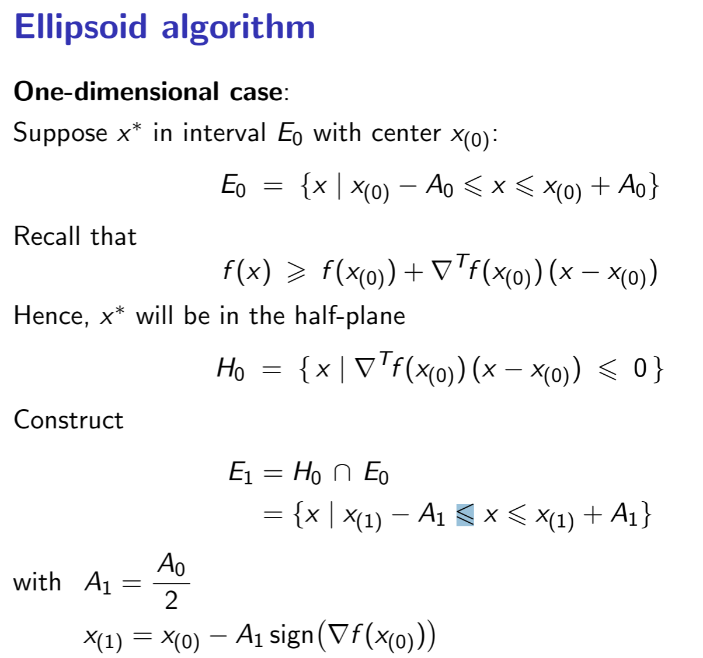
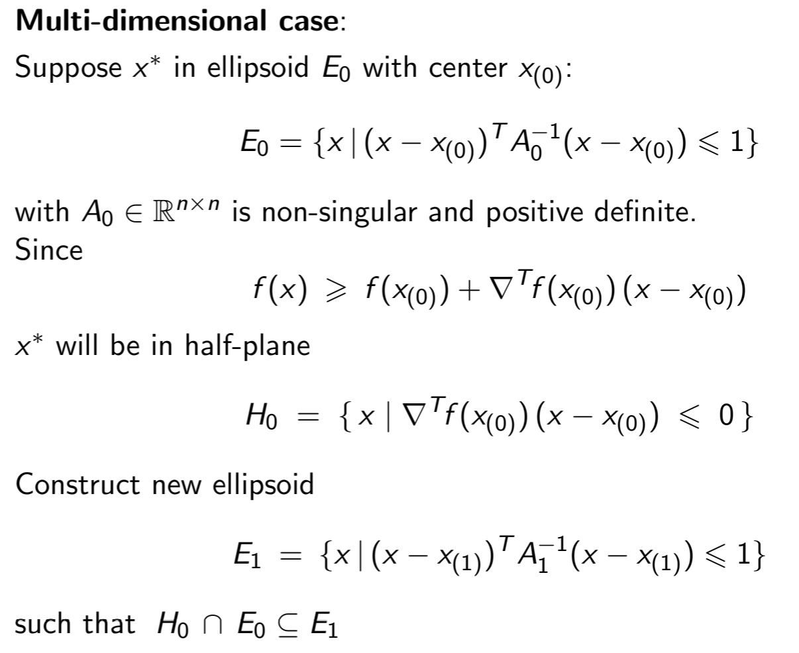

# 第六章 凸优化

## 问题定义

$$ \min \limits_{x}f(x) \quad s.t. \; g(x)\leq0 $$
其中$f,g$均为凸函数
### 凸函数定义及性质
函数$f$为凸函数，当且仅当对于所有$x,y\in dom(f),\lambda\in[0,1]$,有：
$$ f(\lambda x+(1-\lambda)y)\leq\lambda f(x)+(1-\lambda)f(y) $$
若f为凸函数，那么:
$$f(x)\geq f(x_0)+\triangledown^{T}f(x_0)(x-x_0)$$

## 椭球法

### 二维理解

### 多维扩展

### python代码
```python
# coding=utf-8
# 利用椭球法解决凸优化问题
import numpy as np
import matplotlib.pyplot as plt
class Objective_func(object):
    def __init__(self):
        pass
    @classmethod
    def value(cls, x):
        x = x.flatten()
        return 4*((x[0]-10)**2) + (x[1]-4)**2
    @classmethod
    def value2(cls, x0, x1):
        return 4*((x0-10)**2) + (x1-4)**2
    @classmethod
    def differential(cls, x):
        return np.array([8*(x[0]-10), 2*(x[1]-4)]).reshape(-1, 1)

class Constraint_func(object):
    B = np.array([[1, -1, -10], [-1, 1, 3], [-1, 0, 0]])
    @classmethod
    def value(cls, x):
        x = x.reshape(-1, 1)
        x = np.concatenate((x, [[1]]), axis=0)
        return np.dot(cls.B, x)
    @classmethod
    def differential(cls, x, index):
        return cls.B[index][0:2].reshape(-1, 1)

def ellipsoid_method(start_point, A, objective,     constraint, iters=30):
    point_k = start_point
    A_k = A
    n = len(start_point)
    efficient = n**2/(n**2-1)
    point_list = []
    for i in range(iters):
        if max(constraint.value(point_k)) <= 0:
            diff_x_k = objective.differential(point_k).reshape(-1, 1)
        else:
            index = np.argmax(constraint.value(point_k))
            diff_x_k = constraint.differential(point_k, index)
        # print(constraint.value(point_k))
        # print(diff_x_k)
        # diff_x_k = np.array([[-1], [0]])
        point_k -= 1/float(n+1)*np.dot(A_k,diff_x_k)/np.sqrt(diff_x_k.T@A_k@diff_x_k)
        A_k = efficient*(A_k-2/(n+1)*(A_k@diff_x_k@diff_x_k.T@A_k.T)/(diff_x_k.T@A_k@diff_x_k))
        point_list.append(point_k.flatten())
    return point_list

def plot_picture(func, **kwargs):
    x = np.linspace(-1, 12, 500)
    y = np.linspace(-1, 5, 500)
    #X, Y = np.meshgrid(x, y)
    # 填充等高线
    # contour = plt.contour(X, Y, func(X, Y), 20)
    # plt.clabel(contour, fontsize=10, colors='k')
    plt.plot(kwargs["y"])
    # 显示图表
    plt.show()


if __name__ == "__main__":
    obj = Objective_func()
    cons = Constraint_func()
    start_point = np.array([[0.0], [0.0]])
    A = np.array([[100.0, 0.0], [0.0, 100.0]])
    points = ellipsoid_method(start_point, A, obj, cons, iters=50)
    plot_arguments = {}
    plot_arguments["x"] = np.array([sample[0] for sample in points])
    plot_arguments["y"] = np.array([sample[1] for sample in points])
    plot_picture(obj.value2, **plot_arguments)
```
